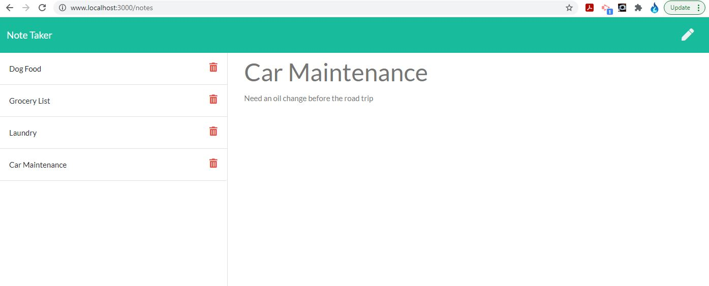

# Note Taking App

## Deployed site

edit this

## Table of Contents

-   [Description](#description)
-   [Installation](#installation)
-   [Usage](#usage)
-   [Technology](#technology)
-   [Contributions](#contributions)
-   [Questions](#questions)

## Description

How many times have you found yourself needing to write something simple down for future reference? A simple reminder, or a "to do" item, or even something more in depth... We might not carry pen and paper around like we use to, but we sure carry our phones. Or when you are at you desk with your computer you can open a simple app. Welcome to the Note Taking App, a very simple way for you to jot something down without too much hassle.

## Installation Instructions

You can run this from the deployed Heroku site listed above, or you can download the directory, install Node and run the "node server.js" command from your terminal.

## Usage

After running the "node server.js" command, open your web browser and in the address bar type in "www.localhost:3000" and the Note Taking App will come up. Click on the "Get Started" button in the middle, this will take you to the main notes page. The center portion of the page is where you title your note and writeout your note underneath. Click on the save button to the top right when you are done and the note will appear on the left side of your screen. Add as many notes as you need with the "write new note" button to the top right, you can always click back on the note and edit it or you can delete it when the note is no longer needed.

## Technology Stack

The following technologies were used to create this site/application/software/project:
HTML, CSS, BootStrap, Font Awesome, JavaScript, jQuery, Node, Express, Heroku

## Contributions

The following individuals contributed to the creation of this site/application/software/project:
Super Awesome support team and Incredibly Awesome Instructor/Facilitator.

## Questions

If you have questions or comments about this project, please feel free to contact me via e-mail:
llanesm@gmail.com

You can also find more of my projects on my GitHub page:
https://github.com/mrllanes

## Screenshots

Please see the images below to see how the Note Taking App looks!

